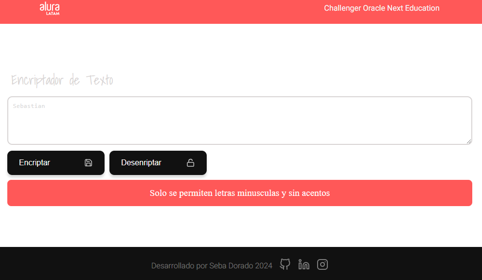
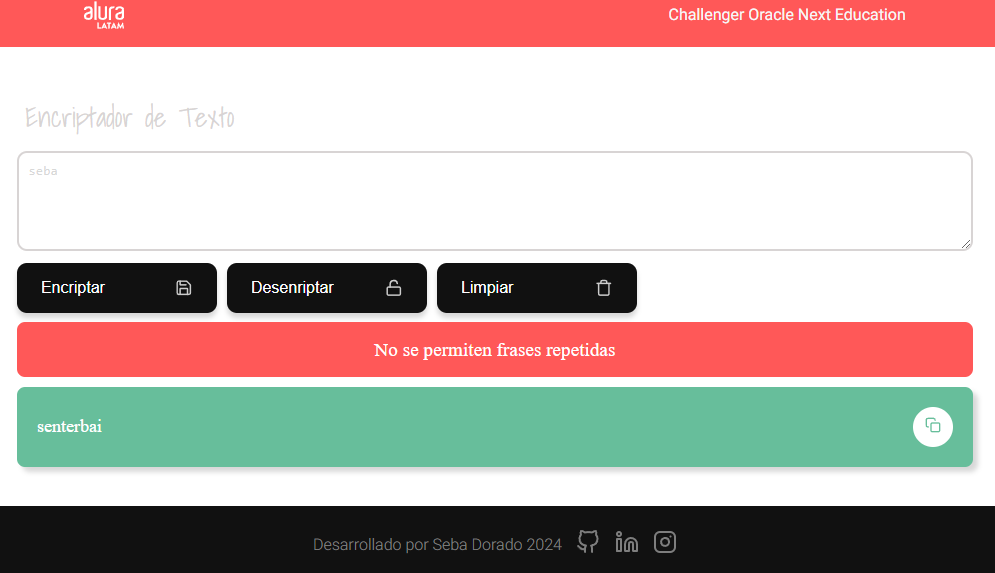

<h2>CHALLENGER ONE ALURA LATAM: Encriptador de Texto</h2>

<h3>Descripcion del Proyecto:</h3>

Vamos a trabajar en una aplicación que encripta textos, así podrás intercambiar mensajes secretos con otras personas que sepan el secreto de la encriptación utilizada.

Las "llaves" de encriptación que utilizaremos son las siguientes:

La letra "e" es convertida para "enter"
La letra "i" es convertida para "imes"
La letra "a" es convertida para "ai"
La letra "o" es convertida para "ober"
La letra "u" es convertida para "ufat"

Requisitos:

- Debe funcionar solo con letras minúsculas

- No deben ser utilizados letras con acentos ni caracteres especiales

- Debe ser posible convertir una palabra para la versión encriptada también devolver una palabra encriptada para su versión original.

- Por ejemplo:
      "gato" => "gaitober"
      gaitober" => "gato"

- La página debe tener campos para inserción del texto que será encriptado o desencriptado, y el usuario debe poder escoger entre Las dos opciones.

- El resultado debe ser mostrado en la pantalla.

Extras:

- Un botón que copie el texto encriptado/desencriptado para la sección de transferencia, o sea que tenga la misma funcionalidad del ctrl+C o de la opción "copiar" del menú de las aplicaciones.

- El Trello es una herramienta de uso individual para que puedas controlar el progreso de tus actividades.

<h3>Estado del Proyecto</h3>

      

 <h3>Características de la aplicación</h3>
 
 

       <h4>Principal</h4>
       
       <h4>Validando si el campo esta vacio</h4>
       
       <h4>Validando caracteres ingresados</h4>
       
       
       <h4>Validando para que no se repita la frase</h4>
       
       <h4>Mensaje de ingresar una frase y presionar el boton de Desencriptar</h4>
       
       <h4>Mensaje al copiar la Frase Encriptada</h4>
       
       <h4>Muestra un mensaje de frase encriptada si presionamos el boton de Encriptar</h4>
       
       <h4>Muestra la frase desencriptada al presionar el boton de desencriptar</h4>
       
       <h5>Se agrega una nueva frase</h5>
        
 

 
 <h3>Acceso al proyecto</h3>
<h4>Enlace al repositorio</h4>

https://github.com/seba279/encriptador-de-texto/

 
 <h4>Enlace para probar el proyecto</h4>
 
https://encriptador-de-texto-smoky.vercel.app/

 <h3>Tecnologías utilizadas</h3>
 
- HTML

 
- CSS

 
- Javascript

 
- Git y Github

 
- Chat GPT

 
- Luri

 
 <h3>Autor</h3>
 Jose Sebastian Dorado
 

